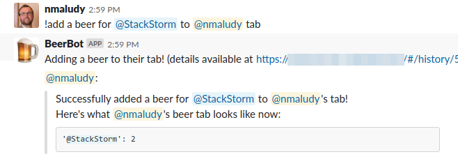
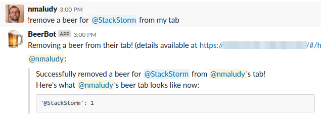
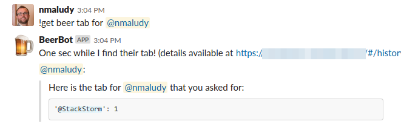
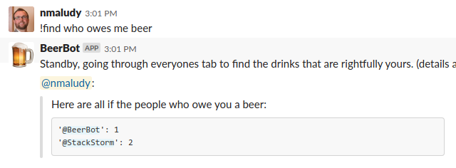

# beertab - The StackStorm pack for keeping tabs on who owes you beer

## Quickstart

``` shell
# upgrade the st2 pack
st2 pack install st2

# install the beertab pack
st2 pack install beertab
```

## Overview

`beertab` is a fun pack that is designed around ChatOps aliases that keep track of
people who owe you beer. It works by storing beer tab data in the StackStorm key/value
datastore and then using StackStorm actions to interface with that data.

## Data format details

Each beer tab has an `owner`, this is the person who owes beer to someone else 
ie. the `recipient`. Recipients are people who are owed beer (usually for good reason).

Each `owner` has their own tab and it is stored uniquely in the datastore under the key
`beertab.{{ chatops_username }}` where `{{ chatops_username }}` is the username of the person in
Chat. Example: `beertab.@DaveSmith`

The value of the beer tab datastore key is a dictionary where each key is a `recipient`
and each value is the number of beer of beers this `owner` owes the `recipient`.

Example, the beer tab for `@DaveSmith` would be stored under the key `beertab.@DaveSmith`
and would have a value of:
``` json
{
  "@nmaludy": 9000,
  "@tom": 2,
  "@johnberry": 7
}
```

## Actions

* `beertab.add` - Adds a beer (1) for a recipient to an owners tab
* `beertab.aggregate` - Performs aggregate opertaions across multiple beer tabs
* `beertab.find` - Finds all beers owed to a recipient across all beer tabs
* `beertab.get` - Gets a beer tab for an owner
* `beertab.modify` - Modifies an individual beer tab by adding, removing, etc beers for a particular recipient.


## ChatOps Aliases

### Adding beer to a tab

The most common thing you're going to need to do is to add beer to your tab or to someone elses.

```
add a beer for {{ recipient }} to my tab
add a beer for {{ recipient }} to {{ owner }} tab
```

When using the `my tab` verison, StackStorm is smart and will pull the user who ran the command
and automatically pass it into the action properly.

Example:

```
add a beer for @DaveSmith to my tab
```

Example:

```
add a beer for @DaveSmith to @nmaludy tab
```




### Removing a beer from a tab

Removing a beer almost never happens, i mean seriously, who pays up on their beer debt?

```
remove a beer for {{ recipient }} to my tab
remove a beer for {{ recipient }} to {{ owner }} tab
```

Example, i was a nice guy and took Greg out for a beer:

```
remove a beer for @Greg from my tab
```



### Getting a beer tab

You may want to see all of the people who you or someone you know owes beer to.

```
get my beer tab
get {{ owner }} beer tab
get beer tab
get beer tab for me
get beer tab for {{ owner }}

```

Example, checking on my beer owing status:

```
get my beer tab
```

Example, check on someone else's tab:

```
get beer tab for @DaveSmith
```



### Finding all of the people who owe you a beer

Last, but probably most important is determining,  across everyone's beer tab, who owes you beer.
This is a great chance to call someone out and extract a hoppy beverage from them.

```
who owes me beer
who owes {{ recipient }} beer
find who owes me beer
find who owes {{ recipient }} beer
```

Example, finding people who owe you beer:

```
who owes me beer
```

Example, finding people who owes someone else beer:

```
who owes @brad beer
```


